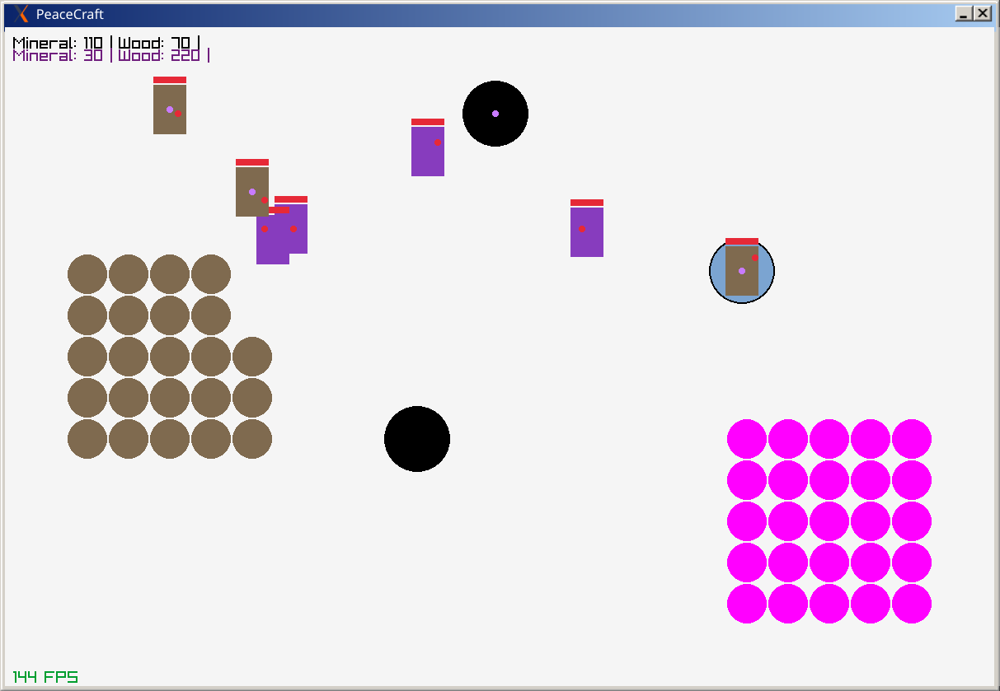

# PeaceCraft

Dummy Warcraft imitation.

- 2 teams
- buildings (and creating buildings)
- characters (and creating characters)
- resource collection
- attacking
- large map
- character commands
- enemy self-automations (~AI)

